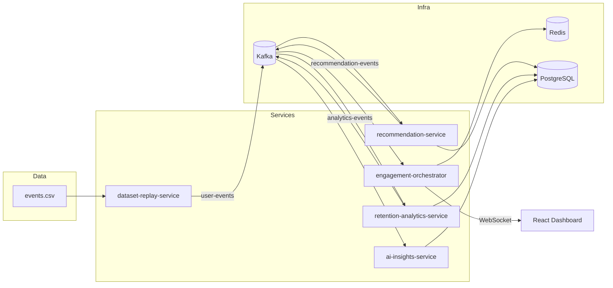

# Real-Time Personalized Engagement Platform with Customer Retention Analytics

A university-level, end-to-end event-driven platform inspired by Netflix, Amazon, and Spotify. It demonstrates real-time recommendations, customer retention analytics, live dashboard updates, ROI tracking, and lightweight AI insights.

## Documentation

For **complete end-to-end flow documentation** (every service, Kafka message, formula, WebSocket protocol, and demo step), see:

**[docs/COMPLETE_SYSTEM_FLOW.md](docs/COMPLETE_SYSTEM_FLOW.md)**

## Architecture



## Kafka Event Flow

| Topic | Producer | Consumer | Partition Key |
|-------|----------|----------|---------------|
| `user-events` | dataset-replay | recommendation, engagement, retention-analytics | `userId` |
| `recommendation-events` | recommendation | engagement-orchestrator | `userId` |
| `dashboard-events` | engagement-orchestrator | (extensibility) | `userId` |
| `analytics-events` | retention-analytics, ai-insights | engagement-orchestrator, ai-insights | `global` / alerts |

## Tech Stack

| Layer | Technologies |
|-------|-------------|
| Backend | Go 1.24+, Gin, Gorilla WebSocket, kafka-go, GORM, PostgreSQL, Redis, Viper, Zap |
| Frontend | React, Vite, Tailwind CSS, Axios, Recharts, Native WebSocket |
| Infrastructure | Kafka, Zookeeper, Redis, PostgreSQL, Docker Compose |

## Project Structure

```
├── services/
│   ├── dataset-replay-service/     # Replay Retailrocket CSV → Kafka
│   ├── recommendation-service/     # Rule-based recommendation engine
│   ├── engagement-orchestrator/    # Redis cache + WebSocket push
│   ├── retention-analytics-service/# Retention, CTR, ROI metrics
│   └── ai-insights-service/        # Retention agent + SQL assistant
├── frontend-dashboard/             # React Netflix-style UI
├── pkg/                            # Shared config, kafka, models, redis
├── migrations/                     # schema.sql + seed.sql
├── data/                           # Sample events.csv (replace with Kaggle dataset)
└── docker-compose.yml
```

## Quick Start (Docker)

### Prerequisites

- Docker & Docker Compose
- 8GB+ RAM recommended

### Run entire stack

```bash
docker compose up --build
```

| Service | URL |
|---------|-----|
| **Frontend Dashboard** | http://localhost:3000 |
| Dataset Replay API | http://localhost:8081 |
| Recommendation API | http://localhost:8082 |
| Engagement / WebSocket | http://localhost:8083 |
| Analytics API | http://localhost:8084 |
| AI Insights API | http://localhost:8085 |

### Demo Walkthrough

1. Open **http://localhost:3000**
2. Go to **Replay** → click **Start Replay**
3. Open **Dashboard** → select User 1–5 → watch recommendation rows update live
4. Open **Live Activity** → see streaming customer events
5. Open **Analytics** → retention, CTR, conversion, ROI charts refresh every 3s
6. Open **AI SQL** → try *"Show top retained users"* or *"Show highest conversion categories"*

## Dataset Setup

A **sample** `data/events.csv` (30 events) is included for immediate demo.

For the full [Retailrocket Ecommerce Dataset](https://www.kaggle.com/retailrocket/ecommerce-dataset):

```bash
# Configure Kaggle API (~/.kaggle/kaggle.json)
chmod +x scripts/download-dataset.sh
./scripts/download-dataset.sh
```

Files used:
- `events.csv` (required)
- `item_properties.csv`, `category_tree.csv` (optional enrichment)

## Local Development (without rebuilding all services)

```bash
# Start infrastructure only
make infra

# Terminal 2–6: run services
make replay
make recommendation
make engagement
make analytics
make ai

# Frontend
make frontend
```

## API Documentation

### Dataset Replay (`:8081`)

| Method | Endpoint | Description |
|--------|----------|-------------|
| GET | `/api/replay/status` | Current replay state |
| POST | `/api/replay/start` | Start streaming events |
| POST | `/api/replay/pause` | Pause replay |
| POST | `/api/replay/resume` | Resume replay |
| PUT | `/api/replay/speed` | Body: `{"speed": 2.0}` |

### Recommendations (`:8082`)

| Method | Endpoint | Description |
|--------|----------|-------------|
| GET | `/api/recommendations/:userId` | Get personalized recs |

### Engagement (`:8083`)

| Method | Endpoint | Description |
|--------|----------|-------------|
| GET | `/api/dashboard/:userId` | Cached dashboard from Redis |
| GET | `/api/activity` | Live activity feed |
| WS | `/ws/dashboard/:userId` | Real-time dashboard + analytics push |

**WebSocket message types:**
- `dashboard_update` — new recommendations
- `analytics_update` — global metrics
- `activity` — user event notification

### Analytics (`:8084`)

| Method | Endpoint | Description |
|--------|----------|-------------|
| GET | `/api/analytics` | Current metrics snapshot |
| GET | `/api/analytics/history` | Historical metric records |

**Metrics formulas:**

- **Retention Rate** = (Returning Users / Total Users) × 100
- **CTR** = (Recommendation Clicks / Impressions) × 100
- **Conversion Rate** = (Purchases / Views) × 100
- **Engagement Score** = Views + 3×AddToCart + 5×Purchases
- **ROI** = (Revenue Gain − System Cost) / System Cost × 100

### AI Insights (`:8085`)

| Method | Endpoint | Description |
|--------|----------|-------------|
| GET | `/api/ai/alerts` | Retention analysis alerts |
| POST | `/api/ai/sql` | Body: `{"question": "..."}` → SQL + results |

Set `PEP_USE_MOCK_AI=false` and `OPENAI_API_KEY` for OpenAI-powered SQL generation.

## Recommendation Engine (Rule-Based)

1. **Recommended For You** — trending items in user's preferred categories
2. **Trending Now** — globally popular items
3. **Because You Viewed** — co-view / same-category affinity
4. **Cart Recommendations** — complementary items for cart contents

## Redis Caching

- Key: `dashboard:user:{userId}`
- TTL: 5 minutes
- Written by engagement-orchestrator on each recommendation update

## Database

Tables: `users`, `content_catalog`, `categories`, `user_events`, `recommendations`, `analytics_metrics`

Schema auto-applied via Docker init scripts in `migrations/`.

## Environment Variables

| Variable | Default | Description |
|----------|---------|-------------|
| `PEP_PORT` | 8080 | Service HTTP port |
| `PEP_KAFKA_BROKERS` | kafka:29092 | Kafka broker list |
| `PEP_POSTGRES_DSN` | (see .env.example) | PostgreSQL connection |
| `PEP_REDIS_ADDR` | redis:6379 | Redis address |
| `PEP_EVENTS_CSV_PATH` | /data/events.csv | Replay CSV path |
| `PEP_USE_MOCK_AI` | true | Use rule-based SQL mock |
| `OPENAI_API_KEY` | — | Optional OpenAI key |

## AI Features

### 1. Retention Analysis Agent
Rule-based monitoring of analytics metrics. Detects retention drops, low conversion, and underperforming categories. Publishes alerts like:

```json
{
  "alertType": "RETENTION_DROP",
  "category": "Electronics",
  "dropPercentage": 12.5,
  "suggestion": "Increase electronics recommendations"
}
```

### 2. SQL AI Assistant
Converts natural language to safe `SELECT` queries. Mock mode handles common business questions; OpenAI mode available with API key.

## License

University/educational project. Retailrocket dataset subject to [Kaggle terms](https://www.kaggle.com/retailrocket/ecommerce-dataset).
